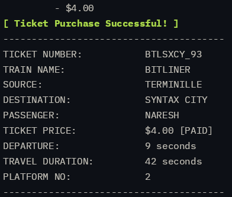

# Terminal Valley

RPG pseudo-open-world adventure game based on CLI, involves extensive use of object-oriented programming paradigm, with storylines, quests, NPC interactions , railway travel system, and more!
More info soon...

### gameplay snippets:

#### Railway TRavel System:

dynamic trains based on routes and prices...

#### realistic life-like-components:

#### NPC Interactions

#### Self sustaining economy:

...all in your beloved terminal based UI (it's actualy the terminal itself!);
